# **Growva Study**

## **ATS CV Maker — Project Vision Document**

### **1. Core Concept**

A **free, reliable, modern CV builder** focusing on **ATS compatibility** while still allowing tasteful visual customization.

**Dark theme by default** (inspired by Vercel, Shadcn, TailwindCSS), with optional light mode.

---

### **2. Why It Stands Out**

- **Reliable** — Auto-save to `localStorage`, instant preview, zero sign-up required.
- **Practical** — Meets real-world CV needs while allowing light visual touches (icons, section title colors, safe layout tweaks).
- **Logical** — Intuitive section order and editor workflow.
- **Modern & Clean** — Minimal, uncluttered, with Tailwind-like spacing and typography, Shadcn component polish, and Vercel’s sleekness.
- **High Customization Without Chaos** — Control over colors, icons, section order, and templates, while ensuring ATS safety.
- **Totally Free** — No hidden limits, forever.

---

### **3. Allowed Features in ATS Mode**

*(ATS-friendly but still customizable)*

**Visual Styling**

- Custom fonts: Limited to ATS-safe families (Arial, Times, Calibri, etc.).
- Colors: Mostly black/very dark gray for text; section titles and icons can have muted accents.
- Alignment: Mostly left-aligned text for consistency.

**Graphics & Icons**

- Minimal icons for fields like phone, email, location (color customizable).
- No decorative shapes or heavy graphics.
- No profile photo/headshot.
- No skill bars or charts (skills in plain text only).

---

### **4. Templates**

- Variety of **ATS-optimized** templates (all free).
- Each template keeps content plain but styled within ATS-safe rules.
- Customizable: icon visibility, icon color, section title color, section order.

---

### 5. User Flow

```mermaid
%%{init: {'theme':'dark'}}%%
flowchart TD
    A["Landing Page 🏠<br/><small>Dark theme default (Vercel/Shadcn vibe)</small>"] -->|"CTA: Start Free"| B["Choose Template 🎨<br/><small>Clean previews, hover glow on select</small>"]
    B --> C["Edit Content ✏️<br/><small>Two-pane: Left = fields, Right = live preview</small>"]
    C -->|"Guided Tooltips"| D["Customization Panel 🎛️<br/><small>Icons, colors, section titles, spacing</small>"]
    D --> F["Live Preview 👀<br/><small>Side-by-side, instant update</small>"]
    F --> G["Auto-Save 💾<br/><small>Saved ✔ every 3s to localStorage</small>"]
    G --> H["Quick Mode ⚡ vs Custom Mode 🔧<br/><small>Switch anytime</small>"]
    H --> I["Export 📤<br/><small>PDF / Markdown, zero signup</small>"]
    I --> J["Confirmation ✅<br/><small>Your CV is ready — 100% free forever</small>"]

    classDef default fill:#1a202c,stroke:#4a5568,stroke-width:2px,color:#e2e8f0,font-size:14px
    classDef startEnd fill:#2b6cb0,stroke:#3182ce,stroke-width:3px,color:#ffffff
    classDef process fill:#2d3748,stroke:#4a5568,stroke-width:2px,color:#e2e8f0
    
    class A,J startEnd
    class B,C,D,F,G,H,I process
```

---

### **6. UI / UX Design Direction**

### **Color & Theme**

- **Dark Mode (default)** — *Phoenix branding inspired*
    - Background: `#0F172A` (deep slate) or `#0A0A0A` for landing page.
    - Panels: `#1E293B` (slate-800).
    - Primary Accent: Gradient `#FF6B1A → #FFAE42` (phoenix flame).
    - Secondary Accent: `#FF8B3D`.
    - Borders & Dividers: `#334155` (slate-700).
    - Text: `#F8FAFC` (white-ish), with `#CBD5E1` (slate-300) for muted text.
- **Light Mode** — *Clean, minimal, with phoenix warmth*
    - Background: `#F8FAFC`.
    - Panels: White `#FFFFFF` with subtle border `#E2E8F0`.
    - Primary Accent: Gradient `#FF6B1A → #FFAE42`.
    - Secondary Accent: `#FF8B3D`.
    - Borders & Dividers: `#CBD5E1`.
    - Text: `#0F172A` (deep slate), with `#475569` (slate-600) for muted text.
- **Brand Usage Notes**:
    - Primary gradient used for call-to-action buttons, hover glows, icon accents, and key highlights.
    - Accent colors map directly to Shadcn’s `-primary` and `-primary-foreground` tokens for consistent theming.

### **Typography**

- **Font**: Inter, 16px base, 1.65 line height.
- **Titles**: Bold, minimal uppercase, phoenix gradient underline or icon where applicable.
- **Body**: Clean, left-aligned, ATS-safe font options selectable in settings.

### **Layout**

- Tailwind-style generous spacing (`px-6`, `py-8`).
- Card-based panels (Shadcn UI), radius-lg, soft shadows.
- Minimal button shapes, with phoenix-accent hover glow.

### **Motion**

- Soft hover shadows on cards and buttons.
- Smooth fade and slide transitions for panels.
- Gradient shimmer effect on primary CTA in landing page.

---

### **7. UX & Design Details**

**1. Landing Page**

- Background: Deep slate `#0A0A0A`.
- Large phoenix-gradient CTA button: “**Start Free — No Signup**”.
- Mini tagline: *“Modern, ATS-friendly resumes in minutes.”*
- Phoenix-gradient subtle glow effect on hover.
- Light mode toggle in top-right (Shadcn-style switch).

**2. Template Selection**

- Minimal card previews (FlowCV-style).
- Hover: Soft shadow + 2px phoenix-gradient glow border.
- “ATS Optimized” badge in small pill with secondary accent `#FF8B3D`.

**3. Edit Content**

- Left: Form fields in collapsible sections.
- Right: Live CV preview.
- Inline placeholder examples.
- Section headers accented with phoenix gradient line or icon.

**4. Customization Panel**

- Tabs for Colors, Icons, Section Order.
- Icon color picker defaults to phoenix palette.
- Preset ATS-safe colors + phoenix accents for quick select.
- Drag-and-drop section order.

**5. Auto-Save**

- Status in bottom-left:
    - ✅ Green check: “Saved”
    - 🔄 Yellow spinner: “Saving…”

**6. Quick Mode vs. Custom Mode**

- **Quick**: Minimal fields, default phoenix theme.
- **Custom**: Full layout, color, and icon control.

**7. Export**

- Buttons: **Export PDF** (primary phoenix gradient) & **Export Markdown** (secondary).
- Subtext: *"No account required — your data stays private."*

**8. Confirmation Page**

- Big download link styled in phoenix gradient.
- Share template option.
- Trust message: *“Made to help job seekers. 100% free, forever.”*